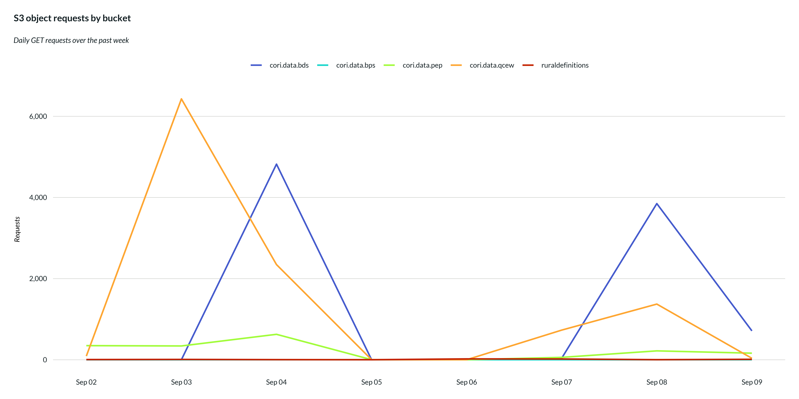
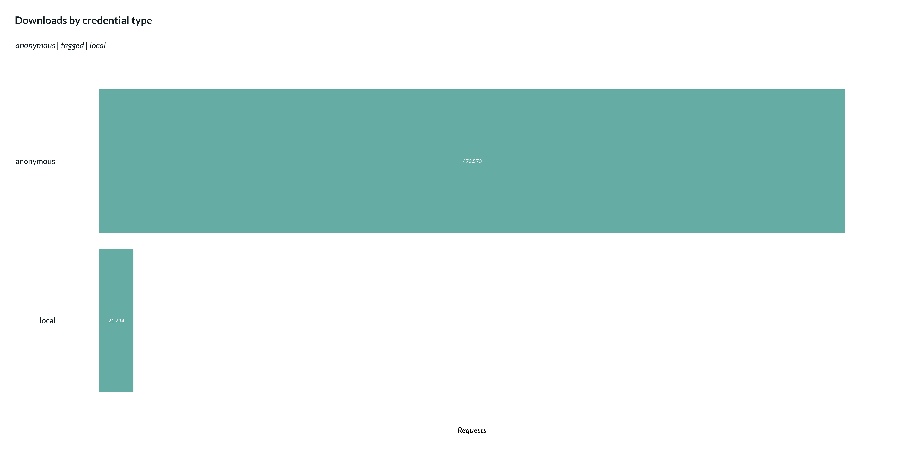
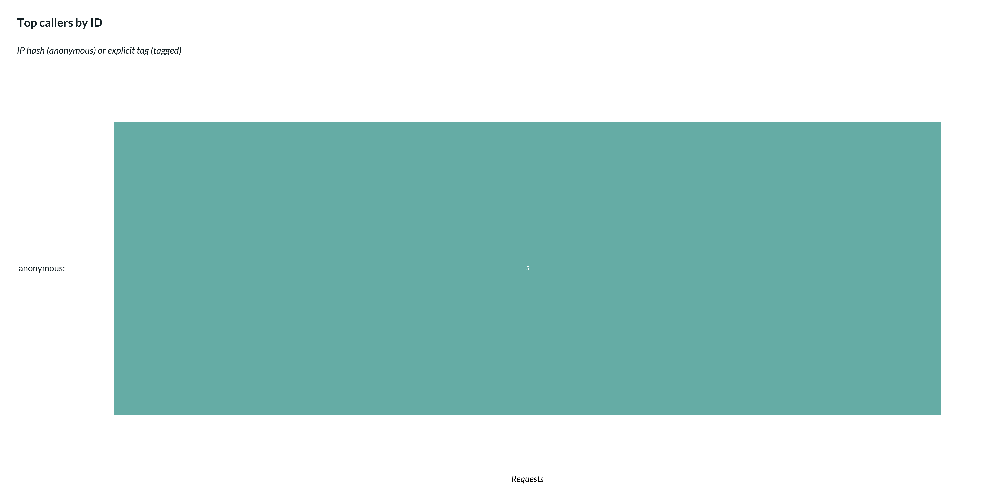

# Monitoring S3 access

Every request to a CORI data bucket is written to an S3 server access
log. This vignette turns those logs into charts: who is downloading
what, from which bucket, and how that changes over time.

## Where the logs live

Server access logging is enabled on every allowlisted bucket except
`cori.data.verse`, which is the destination. Log objects land under a
date-partitioned prefix that encodes both the source bucket and the day:

    s3://cori.data.verse/logs/312512371189/us-east-1/<bucket>/YYYY/MM/DD/<file>

That layout matters for performance. Narrowing the glob to the months
you care about is what keeps a query reading megabytes instead of the
full history — there are hundreds of thousands of small log objects.

``` r

library(cori.data.s3)
library(cori.charts)
library(dplyr)
library(purrr)
library(ggplot2)
library(scales)

load_fonts()
```

## Reading the logs

Access logs are space-delimited with a bracketed timestamp and a quoted
request URI, so they are parsed with a single regular expression rather
than a CSV reader. The important discipline is to aggregate inside
DuckDB and return only a small summary to R — never pull raw log lines
into memory.

``` r


buckets <- c(
  "cori.data.bds",
  "cori.data.bfs",
  "cori.data.bps",
  "cori.data.fcc",
  "cori.data.hu",
  "cori.data.pep",
  "cori.data.qcew",
  "ruraldefinitions"
)

log_pattern <- paste0(
  "^(\\S+) (\\S+) \\[([^\\]]+)\\] (\\S+) (\\S+) (\\S+) (\\S+) (\\S+) ",
  "\"[^\"]*\" (\\S+) (\\S+) (\\S+)"
)

query_template <- "
  WITH raw AS (
    SELECT regexp_extract(line, '%s',
      ['owner','bucket','ts','ip','requester','reqid',
       'operation','key','status','err','bytes']) AS f
    FROM read_csv('%s', delim='\\x01', header = false,
                  columns = {'line': 'VARCHAR'})
  ),
  parsed AS (
    SELECT
      f.bucket                                                 AS bucket,
      CAST(strptime(split_part(f.ts, ' ', 1),
                    '%%d/%%b/%%Y:%%H:%%M:%%S') AS DATE)        AS day,
      f.requester                                              AS requester,
      split_part(f.requester, '/', 3)                          AS session_name,
      TRY_CAST(f.bytes AS BIGINT)                              AS bytes
    FROM raw
    WHERE f.operation LIKE 'REST.GET.OBJECT%%'
  )
  SELECT
    bucket,
    day,
    -- caller_type: for aggregating by credential category
    CASE
      WHEN requester = '-' THEN 'anonymous'
      WHEN requester LIKE '%%CoriDataS3ReaderRole%%'
           AND session_name LIKE 'coridata-anon-%%'
        THEN 'anonymous'
      WHEN requester LIKE '%%CoriDataS3ReaderRole%%'
           AND session_name LIKE 'coridata-tag-%%'
        THEN 'tagged'
      WHEN requester LIKE '%%CoriDataS3ReaderRole%%'
        THEN 'anonymous'  -- legacy format fallback
      ELSE 'local'
    END                                                        AS caller_type,
    -- caller_id: IP hash (anon) or explicit tag (tagged) for drill-down
    CASE
      WHEN requester LIKE '%%CoriDataS3ReaderRole%%'
        THEN regexp_extract(session_name, '^coridata-(?:anon|tag)-([^-]+)-[0-9]+$', 1)
      ELSE NULL
    END                                                        AS caller_id,
    COUNT(*)                                                   AS requests,
    SUM(bytes)                                                 AS bytes
  FROM parsed
  GROUP BY 1, 2, 3, 4
"

activity <- list()

for (b in buckets) {

  # One glob per day for the past week — each query hits a single
  # bucket/date prefix, which is what keeps a query inside the vended
  # credential's lifetime.
  dates <- seq(Sys.Date() - 7, Sys.Date(), by = "day")
  globs <- sprintf(
    "s3://cori.data.verse/logs/312512371189/us-east-1/%s/%s/*",
    b, format(dates, "%Y/%m/%d")
  )

  bucket_activity <- purrr::map(globs, \(g) {
    con <- connect_to_s3("cori.data.verse")
    # NOTE: on.exit() only defers to the exit of an enclosing *function*
    on.exit(DBI::dbDisconnect(con, shutdown = TRUE))

    # A quiet bucket/day legitimately has no log objects, and read_csv()
    # raises an IO Error rather than returning zero rows when its glob
    # matches nothing. glob() returns zero rows instead of erroring, so it
    # is the guard -- one LIST request on the connection that is already
    # authenticated, rather than a second client with its own credentials.
    found <- DBI::dbGetQuery(
      con, sprintf("SELECT count(*) AS n FROM glob('%s')", g)
    )$n

    if (found > 0) {
      DBI::dbGetQuery(con, sprintf(query_template, log_pattern, g))
    } else {
      return(NULL)
    }
  })

  # Appends this bucket's per-day data frames as elements, keeping `activity`
  # a flat list for bind_rows() below. This relies on map() returning a plain
  # list: a data frame is itself a list of columns, so c() would splice one
  # column-by-column rather than appending it whole.
  activity <- c(activity, bucket_activity)
}

activity <- activity |>
  dplyr::bind_rows() |>
  dplyr::filter(
    bucket %in% buckets
  )

glimpse(activity)
#> Rows: 79
#> Columns: 6
#> $ bucket      <chr> "cori.data.bds", "cori.data.bds", "cori.data.bds", "cori.d…
#> $ day         <date> 2026-09-02, 2026-09-03, 2026-09-04, 2026-09-04, 2026-09-0…
#> $ caller_type <chr> "local", "local", "local", "anonymous", "local", "local", …
#> $ caller_id   <chr> NA, NA, NA, NA, NA, NA, NA, NA, NA, NA, NA, NA, NA, NA, NA…
#> $ requests    <dbl> 2, 2, 4761, 60, 3, 2, 37, 4, 3847, 2, 707, 6, 2, 2, 2, 3, …
#> $ bytes       <dbl> 736, 736, 745036330, 780, 1104, 716, 19877407, 588, 390612…
```

One row per bucket, day, caller type, and caller ID. Everything below is
`dplyr` on that frame — the expensive work is already done.

## Downloads over time, by bucket

``` r


activity |>
  filter(day >= Sys.Date() - 7) |>
  filter(bucket != "cori.data.fcc") |>
  group_by(bucket, day) |>
  summarise(requests = sum(requests), .groups = "drop") |>
  ggplot(aes(day, requests, color = bucket)) +
  geom_line(linewidth = 0.8) +
  scale_y_continuous(labels = label_comma()) +
  scale_x_date(date_labels = "%b %d", date_breaks = "1 day") +
  scale_color_viridis_d(option = "turbo", begin = 0.1, end = 0.9) +
  labs(
    title    = "S3 object requests by bucket",
    subtitle = "Daily GET requests over the past week",
    x = NULL, y = "Requests", color = NULL
  ) +
  theme_cori_line()
```



## Who is downloading

The `requester` field carries the full assumed-role session ARN, and the
session name encodes both caller type and a stable identifier:

- `coridata-anon-{ipHash}-{ts}` — anonymous caller with IP-based
  fingerprint
- `coridata-tag-{callerId}-{ts}` — tagged caller with explicit
  identifier

The query unpacks these into two columns: `caller_type` for aggregation
(`anonymous`, `tagged`, or `local`) and `caller_id` for drill-down (the
IP hash or explicit tag).

`anonymous` deliberately combines requests with no credentials at all
and vended credentials without a `caller` tag. Both answer “who did
this?” with nothing — the distinction (had a credential vs. didn’t)
doesn’t matter for attribution. On the public buckets, `anonymous` is
usually the bulk of the traffic. `local` is a separate category: a known
AWS identity that didn’t go through the vending endpoint.

``` r

activity |>
  group_by(caller_type) |>
  summarise(requests = sum(requests), .groups = "drop") |>
  ggplot(aes(reorder(caller_type, requests), requests)) +
  geom_col(fill = cori_colors[["Mid Teal"]]) +
  geom_text(
    aes(y = requests / 2, label = scales::comma(requests)),
    color    = "white",
    fontface = "bold",
    size     = 3.5
  ) +
  coord_flip() +
  scale_y_continuous(labels = label_comma()) +
  labs(
    title    = "Downloads by credential type",
    subtitle = "anonymous | tagged | local",
    x = NULL, y = "Requests"
  ) +
  theme_cori_horizontal_bars()
```



For a deeper look, drill down into individual caller IDs. Anonymous
callers are grouped by an 8-character IP hash; tagged callers show their
explicit tag.

``` r

activity |>
  filter(!is.na(caller_id)) |>
  group_by(caller_type, caller_id) |>
  summarise(requests = sum(requests), .groups = "drop") |>
  slice_max(requests, n = 12) |>
  mutate(label = paste0(caller_type, ": ", caller_id)) |>
  ggplot(aes(reorder(label, requests), requests)) +
  geom_col(fill = cori_colors[["Mid Teal"]]) +
  geom_text(
    aes(y = requests / 2, label = scales::comma(requests)),
    color    = "white",
    fontface = "bold",
    size     = 3.5
  ) +
  coord_flip() +
  scale_y_continuous(labels = label_comma()) +
  labs(
    title    = "Top callers by ID",
    subtitle = "IP hash (anonymous) or explicit tag (tagged)",
    x = NULL, y = "Requests"
  ) +
  theme_cori_horizontal_bars()
```



## Year-to-date summary

``` r

activity |>
  filter(day >= as.Date(format(Sys.Date(), "%Y-01-01"))) |>
  group_by(bucket) |>
  summarise(
    requests    = sum(requests),
    gb          = round(sum(bytes, na.rm = TRUE) / 1024^3, 1),
    caller_ids  = n_distinct(caller_id, na.rm = TRUE),
    .groups     = "drop"
  ) |>
  arrange(desc(requests)) |>
  knitr::kable()
```

| bucket           | requests |    gb | caller_ids |
|:-----------------|---------:|------:|-----------:|
| cori.data.fcc    |   473000 | 164.4 |          0 |
| cori.data.qcew   |    11013 |   2.3 |          1 |
| cori.data.bds    |     9433 |   1.2 |          0 |
| cori.data.pep    |     1766 |   0.1 |          0 |
| ruraldefinitions |       78 |   0.1 |          0 |
| cori.data.bps    |       17 |   0.0 |          0 |

Swap the [`filter()`](https://dplyr.tidyverse.org/reference/filter.html)
for `day >= Sys.Date() - 90` to get the trailing ninety days instead.

## Caveats

Server access logging is best effort. Most requests produce a record and
most records arrive within a few hours, but delivery is neither
guaranteed nor provably complete, and latency means today’s activity is
not visible yet. These numbers are a reliable picture of usage, not an
audit trail — do not present them as a compliance artifact.

In the raw log data, a vended session with no `caller` tag embeds
`coridata-anon-{ipHash}-{ts}` in its session name. The IP hash allows
grouping repeat callers by origin without requiring identification.
Passing a `caller` tag moves a request into the `tagged` category with
an explicit identifier:

``` r

con <- connect_to_s3("cori.data.qcew", caller = "quarterly-refresh")
DBI::dbDisconnect(con, shutdown = TRUE)
```
